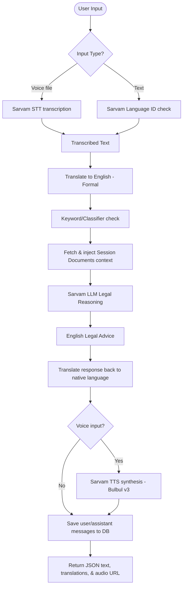

# NeethiMitra Backend Working Notes

## Purpose

This file serves as the up-to-date, single source of truth for the `neethimitra-backend` service inside `D:\NeethiMithra AI`.
It documents the current architecture, database schemas, active endpoints, processing pipelines, and development mock modes.

---

## Technical Stack
- **Framework**: FastAPI (Python)
- **Database**: PostgreSQL (SQLAlchemy ORM + Alembic migrations)
- **CORS Configuration**: Handles web clients. Configured to explicitly match the Vercel production domain (`https://neethimitraai.vercel.app`), dynamic wildcard subdomains (`https://*.vercel.app`), and local development environments.
- **Background Tasks**: Built-in FastAPI async background workers manage document OCR processing outside the HTTP request lifecycle.

---

## Database Models & Schema
The database is structured into the following core tables (defined in `app/models.py`):

1. **`users`**:
   - Supports regular password accounts, Google OAuth accounts, and Anonymous guests.
   - `is_anonymous` (Boolean) & `guest_queries_used` (Integer): Track guest state.
   - `provider`: Authentication source (`"password"`, `"google"`, or `"guest"`).
   - `preferred_language`: Session fallback language.
   - Includes profile fields like `email`, `phone`, `profile_image`, and metadata (timestamps, last login).

2. **`sessions`**:
   - Tracks chat conversations grouped by category (e.g. Land & Property, Cyber Fraud).
   - `category`: The current active category.
   - `language_code`: Main language of this session.
   - `is_active` / `status`: Activity and soft-deletion tracking.

3. **`messages`**:
   - Chat transcript logs.
   - Stores `role` (`"user"` or `"assistant"`), `input_type` (`"text"` or `"voice"`), `text_content` (original text), and `english_translation` (used by AI reasoning).
   - `audio_url`: Reference path to the generated TTS speech audio file.
   - `category`: Category tag for the specific message.

4. **`documents`**:
   - User uploaded files (PDFs, Images) associated with a session.
   - `analysis_status`: Extraction pipeline state (`"pending"`, `"processing"`, `"completed"`, or `"failed"`).
   - `extracted_text` & `extracted_summary`: Markdown text returned by Sarvam Vision and its compiled summary.

5. **`complaints`**:
   - Generated legal complaint PDF history.
   - `pdf_path`: Path to the generated PDF.
   - `draft_text`: Compiled Markdown description.
   - `version`: Tracks version iterations.

6. **`helplines`**:
   - National and regional support helpline catalog. Includes `category`, `number`, `priority`, and location filters.

7. **`refresh_tokens`**, **`auth_sessions`** & **`session_events`**:
   - Analytic logging, token rotation tracks, and security auditing.

---

## Authentication Architecture (`/api/auth`)
The authentication layer relies on JWT Access and Refresh tokens (defined in `app/routers/auth.py`).

- **Registration & Login**:
  - `POST /api/auth/register`: Signup using name, email, and password.
  - `POST /api/auth/login`: Signin using email/password (returns Access & Refresh JWT).
- **Google OAuth Login**:
  - `POST /api/auth/google`: Accepts a Google ID token and uses Google's API Client to verify authenticity against GOOGLE_CLIENT_ID.
- **Guest Lifecycle**:
  - `POST /api/auth/guest`: Spawns a temporary anonymous account. Returns a standard JWT.
  - **Query Enforcement**: Guest requests are restricted to a configurable threshold (default: 3 queries). Attempting queries beyond this returns a `403 Forbidden` response.
  - `POST /api/auth/guest/upgrade`: Allows a guest to link an email and password, converting their account to a permanent registered status without losing their session history.
- **Token Maintenance**:
  - `POST /api/auth/refresh`: Performs refresh token rotation.
  - `POST /api/auth/logout`: Revokes refresh tokens and marks active auth sessions as inactive.
- **User Account**:
  - `GET /api/auth/me`: Fetches profile details.
  - `PATCH /api/auth/me`: Updates name and preferred language.
  - `PATCH /api/auth/me/avatar`: Updates profile picture URL.
  - `DELETE /api/auth/me`: Permanently deletes the account and all cascading data.

---

## Core API Pipelines

### 1. Chat & Translation Pipeline (`app/routers/chat.py`)
Triggered via `POST /api/sessions/{session_id}/messages` (for text) or `POST /api/sessions/{session_id}/voice` (for audio files).

- **Transcription & Translation**: User speech is transcribed via Sarvam STT. Both text and speech queries are translated to English via Sarvam Translate (`mode="formal"`) for the AI model, and responses are translated back (`mode="colloquial"`) to preserve readability.
- **Document Context Injection**: Prioritized by timestamp, any parsed documents (`analysis_status="completed"`) are concatenated and injected into the legal AI prompt context.
- **Dynamic Category Reclassification**: The session category is reclassified dynamically using keyword metrics in `app/agent/classifier.py`. If a user shifts from a Land issue to a Cyber Fraud issue, the category is automatically reclassified.
- **TTS Synthesis**: For voice queries, the assistant response is synthesized to audio using Sarvam TTS.

### 2. Document OCR Pipeline (`app/routers/documents.py`)
- **Upload**: `POST /api/sessions/{session_id}/documents` accepts PDFs and Images (PNG, JPG, JPEG) up to 10MB.
- **Background Extraction**: Saves the file locally and spawns a background worker (`_process_document_async`).
- **Processing**: The worker calls Sarvam Vision to parse markdown formatting from the file. It updates `analysis_status` to `"completed"` or `"failed"` and compiles an automatic summary.
- **System Notification**: Injects a helper assistant message into the chat thread confirming successful document ingestion.

### 3. Complaint PDF Generation (`app/routers/complaints.py`)
- **Generate**: `POST /api/sessions/{session_id}/complaint`
- **Logic**: Compiles the session's user inputs and processed document text into a structured, formal PDF complaint document. It increments version counters in the database.
- **Fetch**: `GET /api/sessions/{session_id}/complaint` retrieves the latest generated complaint draft.

### 4. Helplines Catalog (`app/routers/helplines.py`)
- `GET /api/helplines`: Returns categorized helplines (Land, Cyber, DV) sorted by priority and location filters.

---

## Static File Serving & Download Security (`app/routers/files.py`)
All file repositories are securely served via FastAPI custom router endpoints:
1. **Audio Cache (`/static/audio/{file}`)**: Publicly accessible. Uses unique UUID file naming to prevent enumeration. Serves responses with `Content-Disposition: inline` for direct player playback.
2. **Uploaded Documents (`/static/uploads/{file}`)**: Enforces JWT authorization. Only the owner of the document can fetch it.
3. **Generated PDF Complaints (`/static/complaints/{file}`)**: Enforces JWT authorization. Prevents unauthorized downloads.

